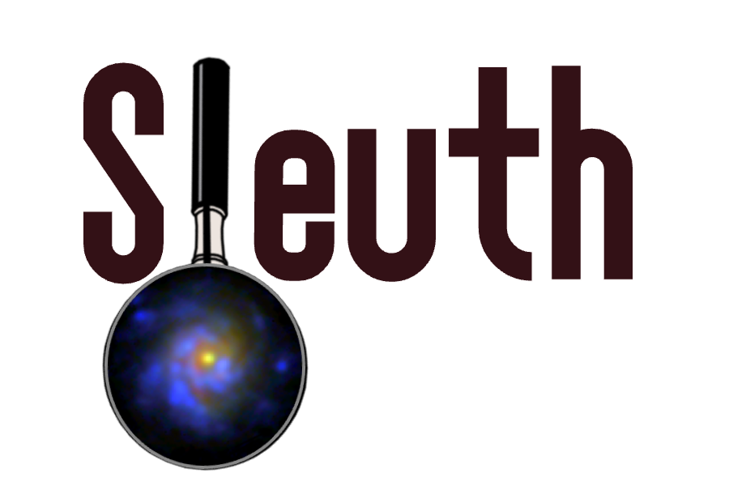

<p align="center">
  
</p>

# Sleuth

Sleuth is a Python package for forward-modeling and extracting spectra from
JWST NIRISS Wide Field Slitless Spectroscopy (WFSS) data. Given imaging,
segmentation maps, and grism exposures for a field, Sleuth builds per-object
2D forward models (continuum + emission line templates, dispersed through
the instrument model), fits them to the grism data, and produces both 1D
spectra and 2D emission line maps.

> **Status:** early / actively developed (v0.1.0). APIs may change without
> notice. This README describes the current package layout and workflow —
> see the docstrings in each module for full parameter details.

## Key features

- **Forward modeling of grism spectra**: dispersion of direct images and
  segmentation-defined regions into simulated 2D grism cutouts ("beams") for
  each object, pupil/filter, and dither position.
- **Template fitting via NNLS**: galaxy spectra are represented as a
  combination of continuum templates, emission line templates, and/or
  top-hat basis functions, fit to the observed grism data with
  non-negative least squares.
- **Priors on fitted flux**: coefficients can be constrained using
  independent flux measurements from broadband imaging, either as a single
  global prior or per spatial region (per segmentation ID).
- **1D spectral extraction** (`OneDExtraction`): a template-free, top-hat
  based extraction of the integrated and per-region 1D spectrum directly
  from the forward model fit, without requiring prior knowledge of line
  positions.
- **2D emission line maps** (`build_line_maps`): drizzled, WCS-tagged flux,
  error, weight, coverage, and mask maps for individual emission lines,
  computed per object and saved to HDF5.
- **Registration correction**: sub-pixel shift and rotation correction
  utilities for aligning forward models to the data, to compensate for
  filter-wheel-induced trace offsets.

## Repository layout

```
sleuth/                     <- repo root
├── sleuth/                  <- importable package
│   ├── __init__.py
│   ├── core.py
│   ├── scene.py
│   ├── templates.py
│   ├── blot_utils.py
│   ├── oned.py
│   ├── linemaps.py
│   ├── photometry.py
│   ├── contam.py
│   └── fitting_utils.py
├── pyproject.toml
├── README.md
└── .gitignore
```

| Module | Purpose |
|---|---|
| `core.py` | `Sleuth` class — top-level driver: fitting, cleans images and beams|
| `scene.py` | `Field`, `Galaxy` — scene/object containers, WCS handling, data I/O (`save_galaxy`, etc.) |
| `templates.py` | Template construction: continuum templates, emission line templates, top-hat basis, template expansion |
| `blot_utils.py` | Blotting/resampling of direct images and segmentation maps onto grism frames |
| `oned.py` | `OneDExtraction` — 1D spectral extraction (integrated and per-region) **experimental**|
| `linemaps.py` | `build_line_maps` — 2D emission line map construction and HDF5 export |
| `photometry.py` | Photometric utilities, e.g. converting imaging measurements into flux priors |
| `contam.py` | Contamination utilities, locates and checks possible contaminating sources |
| `fitting_utils.py` | Fitting utilities, checks and corrects for offsets during fitting |

## Installation

```bash
git clone https://github.com/Vince-ec/sleuth.git
cd sleuth
pip install -e .
```

This installs the `sleuth` package defined by `pyproject.toml` in editable
mode, so local changes to the source are picked up without reinstalling.

### Dependencies

- `numpy`, `scipy`
- `astropy` (WCS, FITS I/O)
- `h5py` (line map output)
- `jax` / `jax.numpy` (used internally for parts of the fitting pipeline)
- `grismagic` (utility to build trace models)

<!-- TODO: confirm/expand this list, and pin versions if there are known
     compatibility constraints (e.g. a specific jax version). -->

## Basic workflow

```python
from sleuth import Sleuth, Field, Galaxy, OneDExtraction, build_line_maps

# 1. Load a field: imaging, segmentation map, grism exposures
field = Field(...)

# 2. Select/construct a single object (galaxy) from the field
gx = field.get_galaxy(obj_id=...)

# 3. Fit forward-modeled templates to the grism data
sleuth = Sleuth(gx, ...)
sleuth.Fit_Pupil(pupil, templates, ...)

# 4. Extract a 1D spectrum (integrated + per-region)
oned_int, oned_reg, coeffs = OneDExtraction(gx, filters=["F150W", "F200W"])

# 5. Build and save 2D emission line maps
maps = build_line_maps(gx, sleuth, template, z)
gx.save_galaxy("galaxies_out/")
```

<!-- TODO: this is a sketch based on the function signatures used in this
     project's development so far — replace with a real, runnable example
     once the top-level API stabilizes. -->

## Output products

- **1D spectra**: integrated object spectrum and per-segmentation-region
  spectra, each with wavelength, flux, and error arrays.
- **2D line maps** (HDF5, one file per object): for each requested emission
  line — flux, error, weight, coverage, mask, WCS, and metadata (rest/observed
  wavelength, redshift, pixel scale, drizzle kernel) — alongside the direct
  image, segmentation map, and object-level metadata.

## Known limitations / active development areas

- Correlated basis functions (e.g. narrow top-hat bins near strong emission
  lines) can produce non-physical dips in extracted 1D spectra under the
  non-negativity constraint; adaptive smoothness regularization is used to
  mitigate this.
- Sub-pixel trace shift/rotation correction is required to compensate for
  NIRISS filter-wheel positioning offsets prior to fitting.

## Citing

<!-- TODO: add a citation / acknowledgment section if this is tied to a
     paper or intended for broader community use. -->

## License

MIT License — see [LICENSE](LICENSE) for details.
